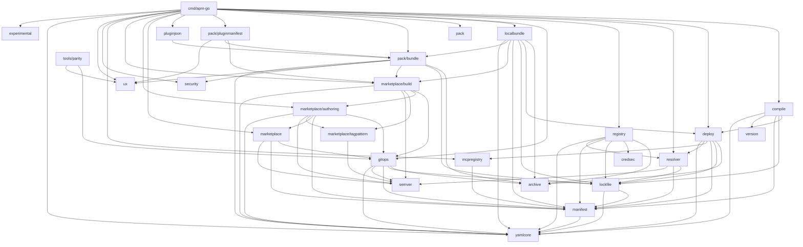
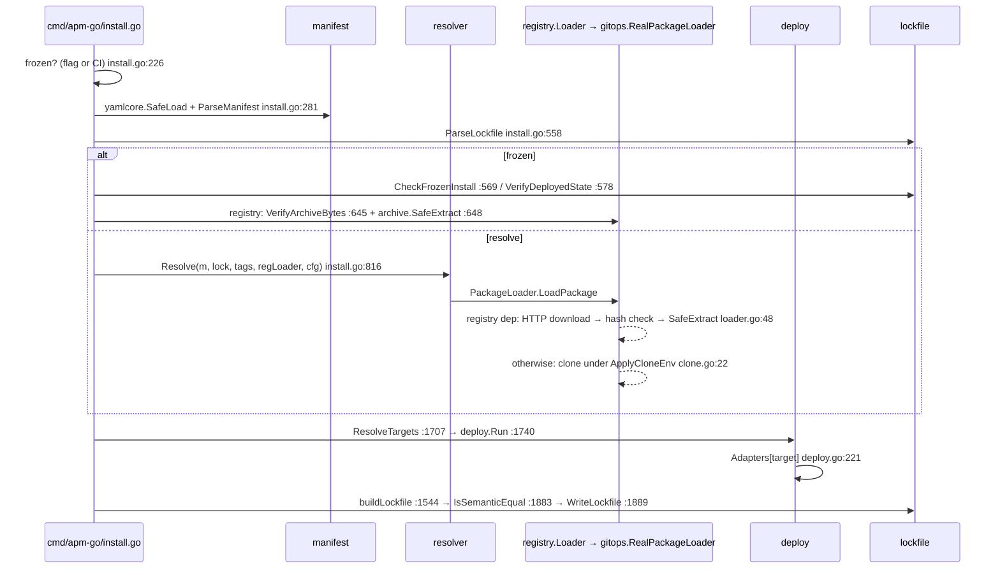
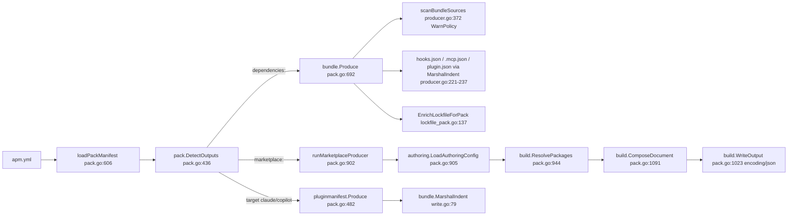
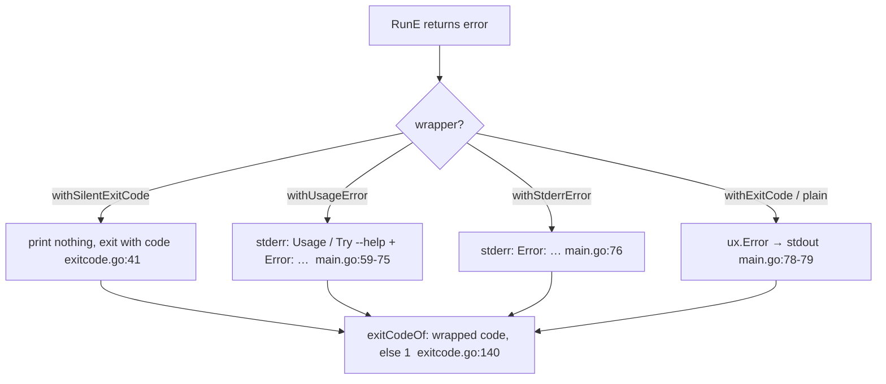

# apm-go architecture

How apm-go is built: the layers, the direction dependencies may point, the data flow of each major command, the cross-cutting mechanisms every layer shares, and the gates a change must pass. Every structural claim is anchored to code as `path:line`. Product facts and the terminal UI design live in [PRODUCT.md](PRODUCT.md); engineering and testing rules live in [AGENTS.md](AGENTS.md). Each topic lives in exactly one of the three files.

Layout: `cmd/apm-go/` holds one file per cobra subcommand; `internal/` holds the libraries listed in §2; `tools/parity/` is the output-contract runner (§5); `spec/conformance/` holds spec tables that tests read at run time.

## 1. Dependency graph

The in-module import graph, from `go list -f '{{.ImportPath}} {{.Imports}}' ./...` (edges from `cmd/apm-go` to every package omitted):

Leaves (import nothing in-module): `archive`, `credsec`, `experimental`, `pack`, `security`, `semver`, `ux`, `version`, `yamlcore`.

**Dependency rules.** A new edge that the graph lacks is a design change; get a ruling before adding it.

- `yamlcore` is the floor for all YAML and depends only on `go.yaml.in/yaml/v4`; `manifest` depends only on `yamlcore`; `lockfile` only on `manifest` and `yamlcore`.
- `deploy` reads only what is already on disk under `apm_modules/`; fetching (`gitops`, `registry`) stays above it. `resolver` fetches through the injected `resolver.PackageLoader` interface (`internal/resolver/types.go:24`), which keeps `gitops` out of it.
- Terminal output is emitted by `cmd/apm-go`, `pack/bundle`, and `pack/pluginmanifest`; every other package returns diagnostics or errors for the command layer to print.
- `security` has two callers: `pack/bundle` and `cmd/apm-go/audit_content.go` (§4).

## 2. Packages: what each owns, where to enter

| Package | Owns | Entry points |
|---|---|---|
| `cmd/apm-go` | command tree, flags, user-facing text, exit-code mapping | `buildRootCmd` `cmd/apm-go/main.go:20`; `renderRootError` `:55`; `main` `:84` |
| `yamlcore` | safe-subset YAML loading, round-trip patching | `SafeLoad` `internal/yamlcore/safe.go:23`; `SafeDump` `:47`; `SafeDumpManifest` `:56`; `PatchMappingPath` `patch.go:36`; `SpliceSequenceElement` `splice_sequence.go:78`; `RemoveMappingKey` `remove_mapping_key.go:30` |
| `manifest` | `apm.yml` model, dependency-reference parsing (string and dict forms), MCP entries | `ParseManifest` `internal/manifest/manifest.go:77`; `ParseDepString` `depref.go:244`; `ParseDepDict` `depref.go:1018`; `ParseMCPEntry` `mcp.go:24`; `ValidateTarget` `target.go:89`; `RemovePackagesFromManifest` `remove.go:50` |
| `lockfile` | `apm.lock.yaml` model, serialization, frozen decision, hash verification | `ParseLockfile` `internal/lockfile/parse.go:77`; `WriteLockfile` `write.go:26`; `IsSemanticEqual` `write.go:295`; `IsCIEnvironment` `frozen.go:12`; `CheckFrozenInstall` `frozen.go:34`; `VerifyDeployedState` `audit.go:22`; `VerifyArchiveBytes` `hash.go:99` |
| `resolver` | BFS dependency resolution, lockfile replay, diamond and orphan detection, update planning | `Resolve` `internal/resolver/resolver.go:21`; `TagLister` / `PackageLoader` `types.go:9,24`; `PlanFullUpdate` / `PlanScopedUpdate` `update.go:12,25`; `ComputeWhy` `why.go:45` |
| `gitops` | hardened git subprocesses, clone, tag listing, stderr translation | `SecureGitEnv` / `ApplySecureGitEnv` `internal/gitops/secure_env.go:32,53`; `ApplyCloneEnv` `harden.go:68`; `RealPackageLoader.LoadPackage` `clone.go:22`; `RealTagLister` `tags.go:13`; `TranslateGitStderr` `stderr.go:70` |
| `registry` | package-registry HTTP client, composite loader | `Loader` `internal/registry/loader.go:31` (`LoadPackage` `:48`); `ClientForURL` `:176`; `NewClient` `client.go:61`; `ResolveCredential` `auth.go:47` |
| `archive` | tar/zip extraction under size, count, and path limits | `SafeExtract` `internal/archive/extract.go:51`; `SafeExtractZip` `zip.go:30`; `Limits` `extract.go:25`; `Contained` `extract.go:221` |
| `credsec` | whether to attach a credential, drop it on redirect, redact it in output | `ShouldAttachCredential` `internal/credsec/attach.go:14`; `NewAuthDropRedirect` `redirect.go:30`; `NewRedactor` `redact.go:21` (used by `registry/client.go` only) |
| `security` | credential/secret scanning with a policy gate | `SecurityGate.ScanFiles` `internal/security/gate.go:66`; `ScanPolicy` `:10`; `BlockPolicy` / `WarnPolicy` / `ReportPolicy` `:33-35`; `ScanFile` / `Classify` `scanner.go:226,257` |
| `deploy` | primitive collection, conflict resolution, per-target writes, MCP writes, removal | `TargetAdapter` `internal/deploy/adapter.go:13`; `MCPTarget` `:27`; `BundleTarget` `:49`; `Adapters` `:54`; `ResolveTargets` `:99`; `Run` `deploy.go:83`; `RemoveDeployedFiles` `uninstall.go:34` |
| `compile` | `.apm/` instruction collection, AGENTS.md rendering, idempotent write | `Run` `internal/compile/compile.go:206`; `CollectInstructions` `:72`; `RenderAgentsMD` `template.go:28`; `StabilizeBuildID` `buildid.go:16`; `WriteAGENTSMD` `writer.go:55` |
| `marketplace` | source parsing, user registry file, fetch, plugin resolution, validation | `ParseMarketplaceSource` `internal/marketplace/source.go:60`; `Fetch` `client.go:13`; `LoadRegistry` / `AddSource` / `RemoveSource` `registry.go:137,227,246`; `ParseRef` `ref.go:58`; `ResolvePlugin` `resolve_plugin.go:64`; `Validate` `validator.go:105` |
| `marketplace/authoring` | author-side `marketplace:` config, `packages` editing, ref checks, audit, migration | `LoadAuthoringConfig` `internal/marketplace/authoring/schema.go:208`; `AddPackage` / `SetPackage` / `RemovePackage` `editor.go:892,1004,1075`; `CheckPackages` `refcheck.go:785`; `RunAudit` `audit.go:154`; `Migrate` `migrate.go:62` |
| `marketplace/build` | packages → marketplace.json document, output paths, drift and version checks | `ResolvePackages` `internal/marketplace/build/builder.go:145`; `ComposeDocument` `output.go:50`; `WriteOutput` `output.go:232`; `EnsureWithinRoot` `output.go:204`; `CheckMarketplaceDrift` `drift_check.go:154`; `CheckVersionAlignment` `version_check.go:253` |
| `marketplace/tagpattern` | tag-pattern validation, compilation, filtering | `Validate` / `Compile` / `FilterTags` `internal/marketplace/tagpattern/tagpattern.go:45,77,136` |
| `mcpregistry` | MCP registry lookup → deployable entry | `NewClient` `internal/mcpregistry/client.go:53`; `ResolveDeployable` `resolve.go:29` |
| `pack` | which of the three outputs a manifest triggers | `DetectOutputs` `internal/pack/detect.go:36` |
| `pack/bundle` | plugin bundle production, JSON value model, MCP sanitizing, lockfile pack section | `Produce` `internal/pack/bundle/producer.go:110`; `MarshalIndent` `jsonvalue.go:195`; `DeepMerge` `:312`; `SanitizeServers` `mcpjson.go:154`; `EnrichLockfileForPack` `lockfile_pack.go:137` |
| `pack/pluginmanifest` | standalone plugin.json | `Produce` `internal/pack/pluginmanifest/producer.go:32`; `Write` `write.go:41` |
| `pluginjson` | init-time plugin.json / .mcp.json scaffold, staged atomic commit | `Scaffold` / `ScaffoldAgent` `internal/pluginjson/pluginjson.go:28,55`; `NewStagedScaffold` `stage.go:27` |
| `localbundle` | local bundle detection, integrity check, integration | `DetectLocalBundle` `internal/localbundle/detect.go:76`; `VerifyBundleIntegrity` `verify.go:49`; `IntegrateLocalBundle` `integrate.go:96` |
| `ux` | all terminal output and interaction | `Init` `internal/ux/ux.go:33`; `CanPrompt` `:52`; printers `printer.go:21-92`; `Table` / `List` / `Tree` `output.go:74,144,201`; `Spinner` `spinner.go:42`; `NewClack` `clack.go:130`; `Confirm` / `InputForm` / `MultiSelect` `interactive.go:77,194,146` |
| `semver` | range matching, max-satisfying | `Satisfies` / `MaxSatisfying` / `CompareVersions` `internal/semver/semver.go:16,75,67` |
| `experimental` | opt-in feature flags persisted in the user config | `Known` / `IsEnabled` / `RequireEnabled` `internal/experimental/experimental.go:37,100,128` |
| `version` | the release version, injected from the git tag at release link time (`dev` locally) | `Version` `internal/version/version.go:14` |

## 3. Data flows

### 3.1 `apm-go install`

1. `installCmd` assembles `installDeps` (`cmd/apm-go/install.go:37`): `tags` is `gitops.RealTagLister`, `loader` is `gitops.RealPackageLoader` (`:159-160`). Tests inject both.
2. `runInstall` (`:209`) decides frozen first; with no flag and `lockfile.IsCIEnvironment()` true it forces frozen and prints an info line (`:226-229`).
3. `apm.yml` goes through `yamlcore.SafeLoad` → `manifest.ParseManifest` (`:281`); each direct dependency passes `manifest.CheckInsecureDependencyScheme` (`:535`).
4. Non-frozen: build the composite loader `registry.Loader{Next: deps.loader}` (`:807`) and call `resolver.Resolve` (`:816`); marketplace references resolve through `newMarketplaceResolveFunc` (`cmd/apm-go/marketplace_resolve.go:39`).
5. Deploy: `deploy.ResolveTargets` (`:1707`) picks targets; `deploy.Run` (`:1740`) collects local primitives, then direct, then transitive dependencies (`internal/deploy/deploy.go:83-135`) and calls `DeployPrimitive` / `WriteMCP` / `FinalizeBundles` on `Adapters[target]` (`:221`, `:255`, `:339`).
6. Lockfile: `buildLockfile` (`:1544`) merges the registry's `Resolutions()` with `gitops.ResolveCommit` for git deps (`:1647`); `IsSemanticEqual` prints "Already up to date" (`:1883`), otherwise `WriteLockfile(newLock, existingNode)` patches over the existing node so unknown fields survive (`:1889`; `internal/lockfile/write.go:36`).
7. A first positional argument that is a local bundle takes `tryLocalBundleInstall` (`:958`): `localbundle.DetectLocalBundle` → `VerifyBundleIntegrity` → `IntegrateLocalBundle` → `persistLocalBundleDeployment` (`:964-1126`).

### 3.2 `apm-go compile`

1. `compileCmd` → `runCompile` (`cmd/apm-go/compile.go:25,41`); `loadCompileManifest` (`:97`) uses `yamlcore.SafeLoad` + `manifest.ParseManifest` (`:110`).
2. `compile.HasCompilableContent` false → exit early (`:51`); after `deploy.ResolveTargets`, `compile.FilterAgentsFamily` keeps the agents-family targets (`:56-57`).
3. `compile.Run` (`internal/compile/compile.go:206`): `CollectInstructions` (`:72`; local `.apm/` plus `apm_modules/` dependencies, frontmatter via `frontmatter.go:29`) → `RenderAgentsMD` (`template.go:28`) → `StabilizeBuildID` (`buildid.go:16`) → `WriteAGENTSMD` (`writer.go:55`): identical content leaves the file untouched; otherwise temp file + rename.

### 3.3 `apm-go pack`

- `runPack` (`cmd/apm-go/pack.go:408`) under `--json` calls `ux.SetConsoleStderr(true)` (`:416`) so status lines move to stderr and stdout carries only `emitPackJSON` (`pack_json.go:110`).
- Release gates: `runReleaseGates` (`:1162`) chains `build.CheckVersionAlignment` (`:1186`) and the drift check.
- Every output directory passes `build.EnsureWithinRoot` (`:644`, `:994`), keeping writes inside the project.
- The credential scan inside `Produce` runs under `security.WarnPolicy` (`internal/pack/bundle/producer.go:381,389`): it warns and continues; dry-run skips it.

### 3.4 `marketplace add` / `marketplace package add` / `marketplace audit` / `marketplace init`

**`marketplace add`** (`cmd/apm-go/marketplace.go:162`): `marketplace.ParseMarketplaceSource` (`:187`) → `marketplace.Fetch` (`:237`; dispatches on `Kind()` to github / gitlab / git / local / url, `internal/marketplace/client.go:13`; the git path runs under `gitops.ApplySecureGitEnv` / `ApplyCloneEnv`, `client_git.go:83,92`) → `marketplace.AddSource` (`:256`) writes the user registry file (`internal/marketplace/registry.go:227`; path from `RegistryPath` `:112`).

**`marketplace package add`** (`cmd/apm-go/marketplace_package.go:123`): `authoring.AddPackage` (`:196`) → `verifyPackageSource` / `resolveRef` (`internal/marketplace/authoring/editor.go:354,682`; refs listed via `RefLister` over git) → `editPackagesFile` (`:163`): `yamlcore.SafeLoad` on the original bytes (`:173`) → `yamlcore.SpliceSequenceElement` replaces only the one sequence element (`:185`), falling back to `yamlcore.PatchMappingPath` for the whole block (`:197`) → `validateEditedPackageBytes` reloads and validates (`:91`) → `atomicWriteFile` (`:219`). Edit failures return `withExitCode(2, err)` (`marketplace_package.go:198`). `set` and `remove` share the function with ops `SeqSet` / `SeqRemove` (`editor.go:1064,1085`).

**`marketplace audit`** (`cmd/apm-go/marketplace_authoring_audit.go:28`): `marketplace.FindByName` (`:78`) → `marketplace.Fetch` (`:89`) → `authoring.RunAudit(m, name, host, localRoot, DefaultApmYMLFetcher)` (`:109`) yields one `PluginAuditReport` per plugin (`internal/marketplace/authoring/audit.go:114`) → `printAuditReports` / `printBypassTree` render as a `ux` tree (`:172,204`).

**`marketplace init`** (`cmd/apm-go/marketplace_authoring.go:40`): `authoring.RenderInitBlock` produces the block text; `spliceMarketplaceBlock` (`:160`) inserts it into the existing `apm.yml` with `yamlcore.PatchMappingPath` (`:181`).

### 3.5 `init` / `plugin init`

1. `initCmd` (`cmd/apm-go/init.go:121`) and `pluginInitCmd` (`plugin.go:27`) both call `runInitCore(args, mode, yes, target, force, verbose)` (`init.go:149`).
2. Interactive when `!yes && ux.CanPrompt()` (`:167`); `CanPrompt` reads stdin/stderr TTY state and CI, and deliberately ignores `NO_COLOR` (`internal/ux/ux.go:52`).
3. Interactive path: `ux.NewClack(os.Stderr)` (`:168`) → `Intro` (`:171`) → `Step` / `Form` / `MultiSelect` (`interactiveTargetSelect` `:630`) → `Note("About to create")` (`:345`) → file creation → `Note("Initializing")` holding the success content (`clackRenderer` `:510,542`) → `Outro` (`:415`). `Clack` methods: `internal/ux/clack.go:144-343`. Frame rules: [PRODUCT.md § Terminal UI design](PRODUCT.md#terminal-ui-design).
4. Non-interactive (`--yes`, no TTY, CI): `renderSuccessBlock` (`:479`) prints the same content as plain status lines.
5. Plugin mode writes through `pluginjson.NewStagedScaffold` (`:575`; `internal/pluginjson/stage.go:27`): files are staged in a project-local temp dir and committed in one move; any failure rolls back.

### 3.6 Errors and exit codes

- The root command sets `SilenceErrors: true` (`cmd/apm-go/main.go:29`); `renderRootError` (`:55`) is the only place errors are printed. `main` (`:84`) runs `ux.Init()` then `root.ExecuteC()`, and on error `os.Exit(renderRootError(cmd, err))`.
- Wrappers: `withExitCode` `cmd/apm-go/exitcode.go:24`, `withSilentExitCode` `:41`, `withUsageError` `:82` (usage errors are 2), `withBareUsageError` `:100`, `withStderrError` `:111`; predicates `isSilentExit` `:51`, `exitCodeOf` `:140`.
- `ux.Error` / `ux.Warn` given `os.Stderr` are redirected to stdout by `errWriter` (`internal/ux/printer.go:75`); `pack --json` is the one caller that flips this with `SetConsoleStderr` (`:87`).

## 4. Cross-cutting mechanisms

**ux.** `ux.Init` (`internal/ux/ux.go:33`) detects TTY, `NO_COLOR` (`:112`), and the CI variables `CI` / `GITHUB_ACTIONS` / `GITLAB_CI` / `BUILDKITE` / `TF_BUILD` / `JENKINS_URL` (`isCI` `:117-121`) once at startup, setting `richMode` (prompts) and `styleEnabled` (spinner animation). lipgloss degrades color per writer. Symbol vocabulary and frame rules: [PRODUCT.md § Terminal UI design](PRODUCT.md#terminal-ui-design).

**YAML round-trip.** Writes to `apm.yml` and `apm.lock.yaml` start from the original bytes, locate with `yaml.Node`, and replace only the affected region through `yamlcore.PatchMappingPath` / `SpliceSequenceElement` / `RemoveMappingKey` / `RebuildSequenceValueDropping`. Built on that: `manifest.RemovePackagesFromManifest` (`internal/manifest/remove.go:50`), `RemoveMCPServersFromManifest` (`mcp_remove.go:34`), and `lockfile.SerializeLockfile(lf, original)` (`internal/lockfile/write.go:36`; keeps unknown fields and `x-*` keys). `SafeDumpManifest` (`yamlcore/safe.go:56`) is for a brand-new `apm.yml` only.

**Safe YAML subset.** Every YAML entry point is `yamlcore.SafeLoad` (`internal/yamlcore/safe.go:23`): anchors/aliases, custom tags, and multi-document streams are rejected. Spec: `spec/conformance/openapm-v0.1.md`.

**gitops secure environment.** Every git subprocess runs under `gitops.ApplySecureGitEnv` (`internal/gitops/secure_env.go:53`: credential prompts off, `GIT_ALLOW_PROTOCOL` allow-list, `GIT_PROTOCOL_FROM_USER=0`) or the clone-specific `ApplyCloneEnv` (`harden.go:68`). Call sites: `gitops/clone.go`, `gitops/tags.go`, `cmd/apm-go/doctor.go:60`, `marketplace/client_git.go:83,92`, `marketplace/authoring/refcheck.go:97`, `marketplace/build/metadata.go:157-170`, `marketplace/build/reflister.go:83`, `tools/parity/preflight.go:290`. Git stderr reaches the user only through `SanitizeGitOutput` / `TranslateGitStderr` (`sanitize.go:17`, `stderr.go:70`).

**Credential scanning.** `security.ScanPolicy.EffectiveBlock` (`internal/security/gate.go:26`) blocks only when `OnCritical == "block"` and force has not overridden it; use one of the three prebuilt policies `BlockPolicy` / `WarnPolicy` / `ReportPolicy` (`:33-35`). `SecurityGate.ScanFiles` (`:66`) does not follow symlinks. Callers: `pack` (warn, §3.3) and `audit` (`cmd/apm-go/audit_content.go:49-84`; a critical finding fails the command). Install and deploy run no scan.

**Exit codes.** §3.6. Usage errors are 2; `marketplace package` edit failures are 2 (`cmd/apm-go/marketplace_package.go:139,198`); `doctor` exits through `withSilentExitCode` with its table already printed.

**JSON bytes.** pack and scaffold JSON go through `bundle.MarshalIndent` (`internal/pack/bundle/jsonvalue.go:195`: 2-space indent, empty containers as `{}` / `[]`, caller appends the trailing newline): `producer.go:221-237`, `pluginmanifest/write.go:79`, `pluginjson/pluginjson.go:86`. The one exception is marketplace.json via `build.WriteOutput` (`internal/marketplace/build/output.go:232`): `encoding/json` with `SetEscapeHTML(false)`, UTF-8 unescaped. The `pack --json` envelope uses `json.MarshalIndent` (`cmd/apm-go/pack_json.go:111`).

**Archive limits.** Extraction goes through `archive.SafeExtract` with `Limits` (`internal/archive/extract.go:25,51`); destinations are checked with `archive.Contained` (`cmd/apm-go/install.go:606`).

**CI detection pin.** `cmd/apm-go/main_testmain_test.go:41` and `internal/ux/ux_testmain_test.go:21` are the two `TestMain`s AGENTS.md describes; the production branches they protect are `install.go:226` (frozen under CI) and `ux.isCI`.

## 5. Gates

**`go test ./...`** verifies Go-level correctness. Injection seams: `installDeps` `cmd/apm-go/install.go:37`, `doctorDeps` `doctor.go:40`, `ux.SetPromptSeamsForTest` / `SetTTYSeamsForTest` `internal/ux/testhooks.go:30,66`, `pluginjson.SetCommitHookForTest` `internal/pluginjson/testhooks.go:10`.

**Conformance tables (`spec/conformance/`)** are run-time inputs to tests, tracked in git:
- `depref-accept.json` → `internal/manifest/depref_conformance_test.go:56` (dependency-reference parsing table; regenerated by `tools/depref_conformance_gen.py`).
- `python-repr.json` → `internal/marketplace/python_repr_conformance_test.go:53`.
- `agent-schema.md` → `internal/marketplace/build/schema_sync_test.go:438` (spec table, JSON schema, and Go struct kept in three-way sync); `internal/pack/bundle/schema_sync_test.go` does the same for plugin.json.
- `openapm-v0.1.md`, `cli-surface-parity-v0.27.0.md`, `cli-verification-checklist.md` are specification documents.

**Output contract — the parity gate (`tools/parity`).** The `parity` job in `.github/workflows/parity.yml` builds `bin/apm-go`, then runs `go run ./tools/parity -cases tools/parity/cases -out parity-out`; before running it greps every case's argv to confirm no network URL is referenced (cases run on local fixtures only). The `go-test` job in the same workflow is separate on purpose: green tests say nothing about the contract.

Runner:
- `Case` (`tools/parity/case.go:18`): `id`, `argv`, `stdin`, `env`, `setup_argv`, `path_prepend`, `timeout_s`, `forbid_substrings`, `expected_taxonomy`, `waiver`; `LoadCases` (`:100`) reads `cases/<id>/case.json` plus `fixture/`.
- Each case runs in a fresh sandbox (new cwd and HOME, `sandbox.go`) with an allow-listed environment (`env.go`) via `runCaseSide` (`runner.go:18`); stdout, stderr, exit code, and the post-run file tree (`postRunTree` `runner.go:207`) are the evidence record.
- `diffCase` (`diff.go:109`) normalizes first (`normalize.go:46`: sandbox paths, hex tokens, timestamp lengths; `normalizeStatusGlyphs` `:73` treats status-symbol shape as the one sanctioned glyph difference), then compares stdout, stderr, exit code, and tree; `--help` cases use semantic comparison (`help_semantic.go`).
- **Waiver** (`waiver.go:18`; `waivers.json`): `id`, `fields`, `tree_paths`, `taxonomy`, `reason`, `owner`, `eval_plan_ref`. `applyWaiver` (`diff.go:484`) counts a case waived only when the waiver covers every differing field; an unknown waiver id fails validation.
- **Baseline** (`baseline.go:40`; `baseline.json`): exact paths of global-state side-effect files, excluded from the tree comparison.
- `countUnwaived` (`diff.go:551`) > 0 returns an error and fails the job (`main.go:237`); `summary.txt` and `parity-out/` are printed and uploaded as an artifact either way.
- **Pending cases** (`tools/parity/cases-pending/`, currently 5): cases recorded as design deviations and kept out of the gate. `README.md` there binds each to a **ticket** in `.scratch/parity-runner/issues/` and requires it to return to `cases/` when the ticket closes.
- The runner has its own `go test` (`tools/parity/*_test.go`) and a `-selftest-only` fault-injection self-check (`main.go:45-54`, `selftest.go`).

**Release.** `release.yml` requires the tagged commit to be an ancestor of `origin/main` (fail-closed) and injects the tag into `Version` via `-ldflags -X` (`internal/version/version.go:14`); tags containing `-` are marked prerelease.
