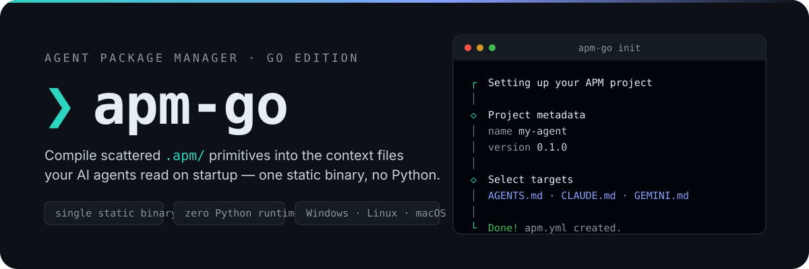
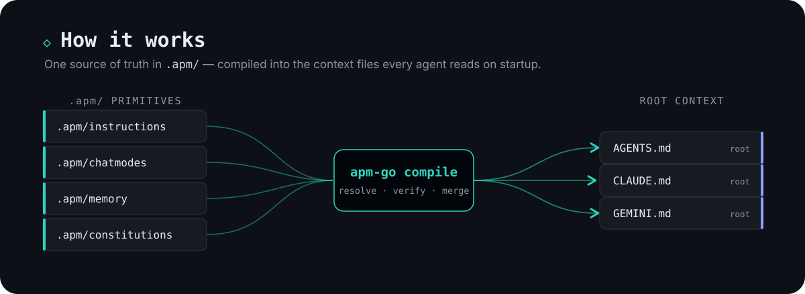

<p align="center">
  
</p>

<p align="center">
  English&nbsp;·&nbsp;<a href="README.zh-TW.md">繁體中文</a>
</p>

<p align="center">
  <a href="https://github.com/gn00678465/apm-go/releases"></a>
  
  
</p>

> A Go re-implementation of [microsoft/apm](https://github.com/microsoft/apm) — the Agent Package Manager — as a single static binary with no Python runtime dependency.


APM is a package manager for AI-native development. Instead of copy-pasting the same guidance into every agent's config, you keep it once as `.apm/` primitives — instructions, chat modes, memory, constitutions — and **compile** them into the root context files each platform reads on startup: `AGENTS.md`, `CLAUDE.md`, `GEMINI.md`, and more. It also installs and deploys packages and MCP server configurations.

apm-go re-implements the common command surface of upstream `apm` in Go, shipped as one static binary. It is deliberately named `apm-go` (`apm-go.exe` on Windows) so it can run side by side with the reference `apm` binary for comparison.




Pre-built binaries are published on [GitHub Releases](https://github.com/gn00678465/apm-go/releases) for Windows, Linux, and macOS (amd64 / arm64). The installers download the binary for your platform, verify its SHA256 checksum, and add it to your PATH.

### Windows (PowerShell)

```powershell
irm https://raw.githubusercontent.com/gn00678465/apm-go/main/install.ps1 | iex
```

Installs to `%LOCALAPPDATA%\apm-go` and adds it to your user PATH. To pin a version:

```powershell
$env:APM_GO_VERSION = "0.2.1"; irm https://raw.githubusercontent.com/gn00678465/apm-go/main/install.ps1 | iex
```

### Linux / macOS

```sh
curl -fsSL https://raw.githubusercontent.com/gn00678465/apm-go/main/install.sh | sh
```

Installs to `~/.local/bin` (appends to `~/.profile` if that directory is not on PATH). To pin a version:

```sh
curl -fsSL https://raw.githubusercontent.com/gn00678465/apm-go/main/install.sh | APM_GO_VERSION=0.2.1 sh
```

Verify with `apm-go --version` in a new terminal.

### Uninstall

```powershell
# Windows
irm https://raw.githubusercontent.com/gn00678465/apm-go/main/uninstall.ps1 | iex
```

```sh
# Linux / macOS
curl -fsSL https://raw.githubusercontent.com/gn00678465/apm-go/main/uninstall.sh | sh
```

### Build from source

Requires [Go](https://go.dev/dl/) 1.26+:

```sh
go build -o bin/apm-go ./cmd/apm-go      # bin/apm-go.exe on Windows
go run ./cmd/apm-go <args>               # run directly
```

Release-size build (strips debug info and paths, ~29% smaller — same flags the release workflow uses):

```sh
go build -trimpath -ldflags "-s -w" -o bin/apm-go ./cmd/apm-go
```


```sh
apm-go init                  # initialize a new APM project (creates apm.yml)
apm-go install               # install dependencies from apm.yml
apm-go compile               # compile installed instructions into AGENTS.md
```

`apm-go init` walks you through project setup interactively — the session in the hero above is exactly what it looks like.


| Command | Description |
|---|---|
| `init` | Initialize a new APM project |
| `install` | Install dependencies from `apm.yml` or by URL/shorthand; also adds MCP servers via `--mcp` |
| `uninstall` | Remove APM packages, their integrated files, and `apm.yml` entries |
| `update` | Re-resolve dependencies to their newest matching version |
| `compile` | Compile installed instructions into a project `AGENTS.md` |
| `audit` | Re-verify deployed-file integrity against `apm.lock.yaml` |
| `marketplace` | Manage marketplace sources (add/list/browse/update/remove/validate) |
| `pack` | Build `marketplace.json`, a plugin bundle, and/or a standalone `plugin.json` from `apm.yml` |
| `validate` | Validate a YAML file against the OpenAPM safe subset and manifest schema |
| `normalize` | Parse and re-emit a YAML file (round-trip) |
| `experimental` | Manage experimental feature flags |

Run `apm-go <command> --help` for detailed flags.


```sh
go build ./...        # build all packages
go test ./...         # run all tests
go test ./... -cover  # with coverage (target ≥ 80%)
go vet ./...          # static analysis
go fmt ./...          # format
```

Releases are automated: pushing a `v*` tag triggers the [release workflow](.github/workflows/release.yml), which verifies the tag against `internal/version`, cross-compiles all six platform binaries with `CGO_ENABLED=0`, generates `SHA256SUMS`, and publishes a GitHub Release.
