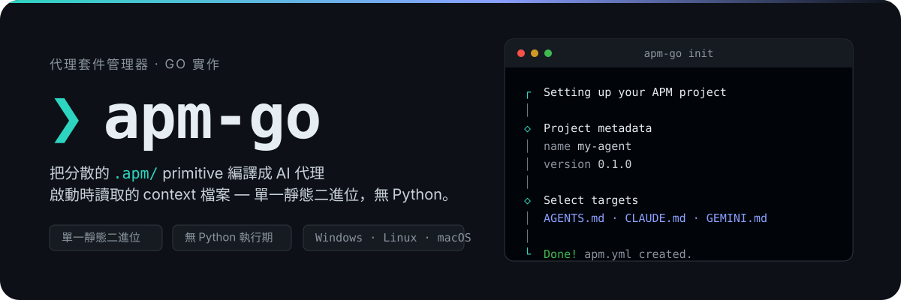
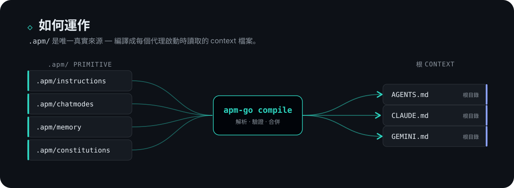

<p align="center">
  
</p>

<p align="center">
  <a href="README.md">English</a>&nbsp;·&nbsp;繁體中文
</p>

<p align="center">
  <a href="https://github.com/gn00678465/apm-go/releases"></a>
  
  
</p>

> [microsoft/apm](https://github.com/microsoft/apm)（Agent Package Manager）的 Go 重新實作 — 單一靜態二進位，無 Python 執行期相依。


APM 是「AI 原生開發」的套件管理器。與其把相同的指引複製貼到每個代理的設定裡，你只需以 `.apm/` primitive 維護一份 — 指令、chat mode、記憶、憲章 — 再**編譯**成各 AI 代理平台啟動時讀取的根 context 檔案：`AGENTS.md`、`CLAUDE.md`、`GEMINI.md` 等，並安裝/部署套件與 MCP 伺服器設定。

apm-go 以 Go 重新實作上游 `apm` 的常用指令面，發佈為單一靜態二進位。二進位刻意命名為 `apm-go`（Windows 為 `apm-go.exe`），可與原版 `apm` 並存以便對照比較。




預編譯二進位發佈於 [GitHub Releases](https://github.com/gn00678465/apm-go/releases)，涵蓋 Windows / Linux / macOS（amd64 / arm64）。安裝腳本會下載對應平台的二進位、驗證 SHA256 checksum，並加入 PATH。

### Windows（PowerShell）

```powershell
irm https://raw.githubusercontent.com/gn00678465/apm-go/main/install.ps1 | iex
```

安裝到 `%LOCALAPPDATA%\apm-go` 並加入使用者 PATH。指定版本：

```powershell
$env:APM_GO_VERSION = "0.2.1"; irm https://raw.githubusercontent.com/gn00678465/apm-go/main/install.ps1 | iex
```

### Linux / macOS

```sh
curl -fsSL https://raw.githubusercontent.com/gn00678465/apm-go/main/install.sh | sh
```

安裝到 `~/.local/bin`（若該目錄不在 PATH，會附加至 `~/.profile`）。指定版本：

```sh
curl -fsSL https://raw.githubusercontent.com/gn00678465/apm-go/main/install.sh | APM_GO_VERSION=0.2.1 sh
```

開新終端機執行 `apm-go --version` 驗證。

### 移除

```powershell
# Windows
irm https://raw.githubusercontent.com/gn00678465/apm-go/main/uninstall.ps1 | iex
```

```sh
# Linux / macOS
curl -fsSL https://raw.githubusercontent.com/gn00678465/apm-go/main/uninstall.sh | sh
```

### 從原始碼建置

需要 [Go](https://go.dev/dl/) 1.26+：

```sh
go build -o bin/apm-go ./cmd/apm-go      # Windows 為 bin/apm-go.exe
go run ./cmd/apm-go <args>               # 直接執行
```

Release 尺寸建置（去除除錯資訊與路徑，約小 29% — 與 release workflow 同旗標）：

```sh
go build -trimpath -ldflags "-s -w" -o bin/apm-go ./cmd/apm-go
```


```sh
apm-go init                  # 初始化 APM 專案（建立 apm.yml）
apm-go install               # 依 apm.yml 安裝相依
apm-go compile               # 將已安裝的 instructions 編譯為 AGENTS.md
```

`apm-go init` 會以互動方式帶你完成專案設定 — 上方 hero 的終端機畫面就是它實際的樣子。


| 指令 | 說明 |
|---|---|
| `init` | 初始化新的 APM 專案 |
| `plugin init` | 初始化 plugin 作者專案（`--format`、`--claude-plugin`） |
| `install` | 依 `apm.yml` 或 URL/shorthand 安裝相依；`--mcp` 可新增 MCP 伺服器 |
| `uninstall` | 移除 APM 套件、其整合檔案與 `apm.yml` 條目 |
| `update` | 重新解析相依至最新符合版本 |
| `compile` | 將已安裝的 instructions 編譯為專案 `AGENTS.md` |
| `audit` | 依 `apm.lock.yaml` 重新驗證已部署檔案完整性 |
| `search` | 在 marketplace 搜尋 plugin（`QUERY@MARKETPLACE`） |
| `marketplace` | 使用 marketplace：`add`、`list`、`browse`、`update`、`remove`、`validate`、`check`、`outdated` |
| `marketplace`（作者側） | 製作 marketplace：`init`、`package add/set/remove`、`audit`、`migrate` |
| `pack` | 從 `apm.yml` 產出 `marketplace.json`、plugin bundle 或獨立 `plugin.json` |
| `doctor` | 環境診斷（git、網路、認證、marketplace 設定）；有嚴重失敗時以非零碼結束 |
| `validate` | 以 OpenAPM 安全子集與 manifest schema 驗證 YAML 檔 |
| `normalize` | 解析並重新輸出 YAML 檔（round-trip） |
| `experimental` | 管理實驗性功能旗標（`enable`、`disable`、`list`） |

各指令詳細旗標見 `apm-go <command> --help`。

### apm-go 獨有的指令與旗標

以下只存在於 apm-go。預設值維持標準行為，不使用時不會改變任何結果。

| 位置 | 新增項目 | 作用 |
|---|---|---|
| `validate` | 整個指令 | 以 OpenAPM 安全子集（不允許 anchor、merge key、自訂 tag）與 manifest schema 檢查任意 YAML 檔 |
| `normalize` | 整個指令 | 將 YAML 檔經安全子集載入後 round-trip 重新輸出（`--stdout` 印到標準輸出） |
| `pack` | `--claude-source-style github\|url` | 在 `marketplace.json` 輸出 `url` 來源，讓 Claude Code 在沒有 SSH 金鑰時改以 HTTPS 安裝 GitHub 套件（預設 `github`） |
| `install` | `--max-archive-bytes`、`--max-entries` | 解壓縮大小（預設 100 MiB）與檔案數（預設 10000）上限，超過即失敗 |
| `install` | `--no-provenance` | `apm.lock.yaml` 省略 `generated_at` 與 `apm_version`，產生可重現的 lockfile |
| `install --mcp` | `--force` | 不詢問直接覆寫衝突的既有 MCP 條目 |
| `init` | `--force` | 不詢問直接覆寫既有 `apm.yml` |
| `audit` | `--content` | 掃描每個已部署檔案的隱藏 Unicode 字元 |
| `update` | `--frozen` / `--no-frozen` | 對 frozen 安裝拒絕範圍更新（CI 自動開啟）／覆寫 CI 自動偵測 |
| `marketplace package add` | `--category` | 套件分類，Codex 輸出在 `pack` 時必填 |
| `marketplace package` | 指令名稱 | 作者側子指令位於 `package` 之下（`add`、`set`、`remove`） |


```sh
go build ./...        # 編譯全部套件
go test ./...         # 執行所有測試
go test ./... -cover  # 含覆蓋率（目標 ≥ 80%）
go vet ./...          # 靜態檢查
go fmt ./...          # 格式化
```

Release 已自動化：推 `v*` tag 觸發 [release workflow](.github/workflows/release.yml) — 守門比對 tag 與 `internal/version`、以 `CGO_ENABLED=0` 交叉編譯 6 平台二進位、產生 `SHA256SUMS`、發佈 GitHub Release。
